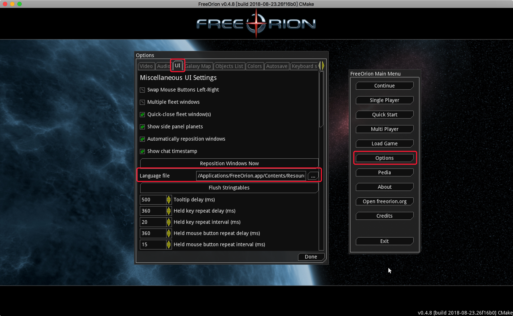
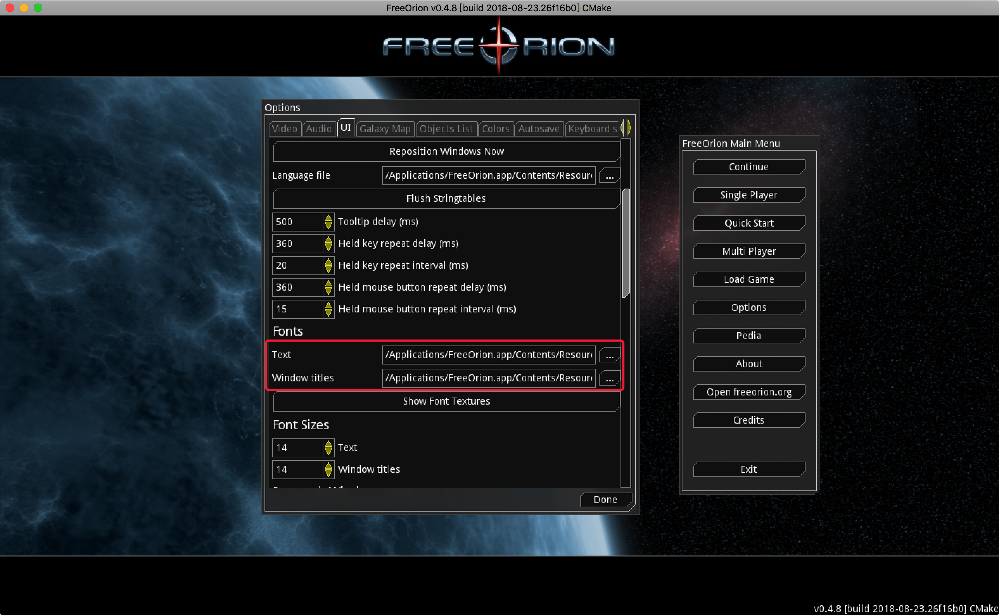
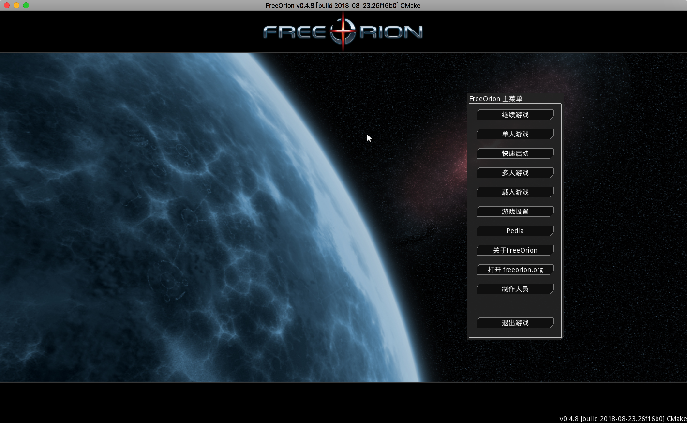
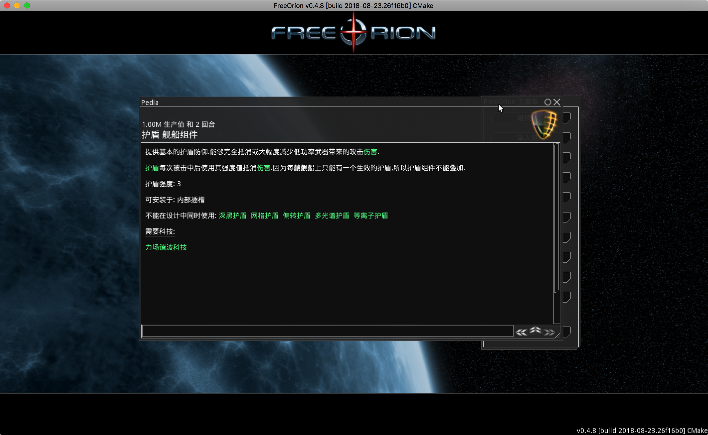
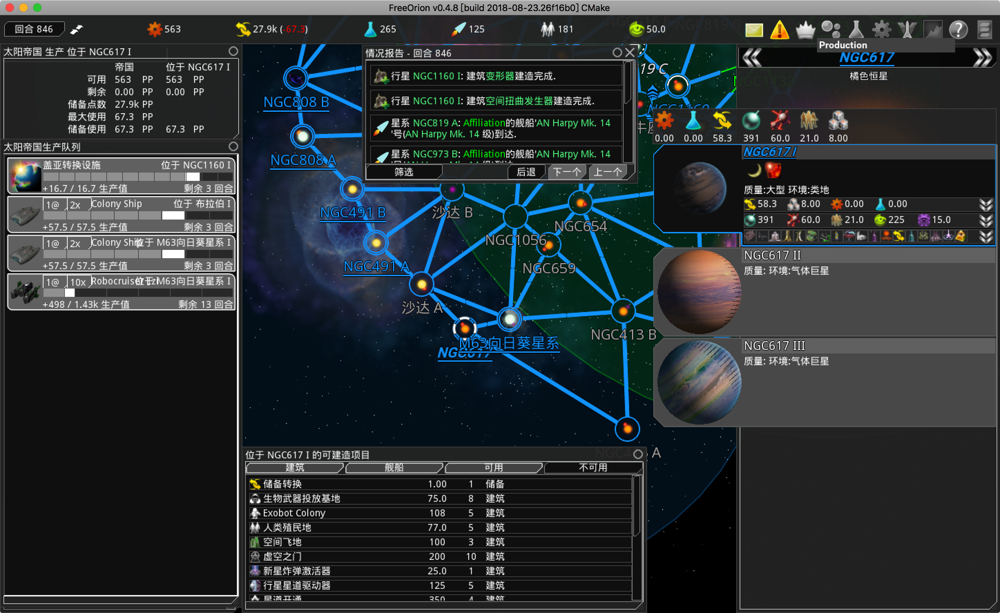
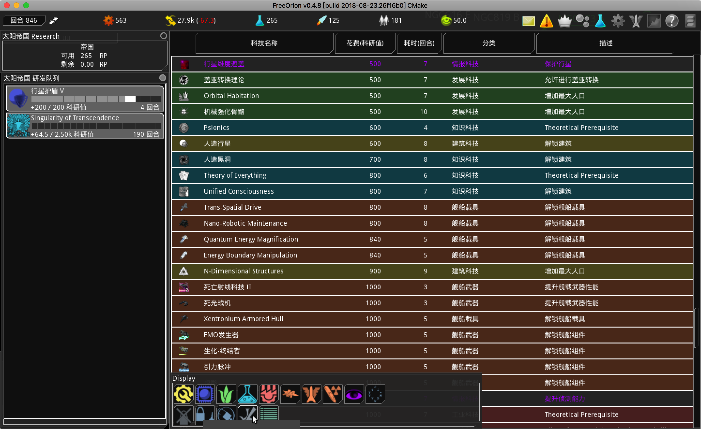
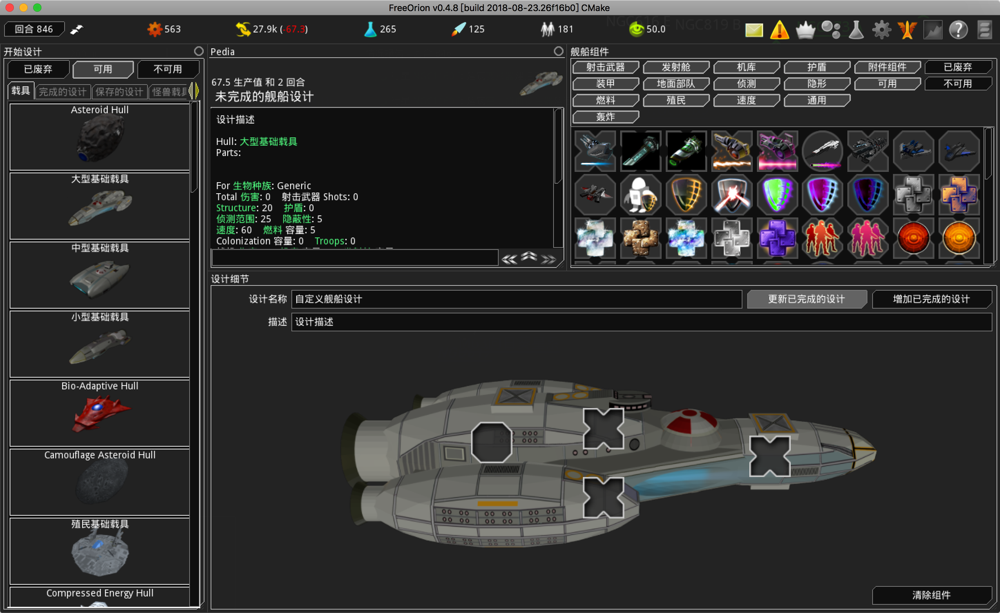

# FreeOrion Chinese Translation
### Summary

This Project is chinese  translation for FreeOrion. Now, about 30% translation has completed.

The Project include two files. One is stringtable file "zh-cn.txt", another is chinese font file "WenQuanYiMicroHei.ttf".

### Usage

Before use translation file, you should install FreeOrion Application.you can download application from [Here](https://github.com/freeorion/freeorion/releases).

#### For MacOS

Copy file "zh-cn.txt" to directory "/Applications/FreeOrion.app/Contents/Resources/default/stringtables", and copy file "WenQuanYiMicroHei.ttf" to directory "/Applications/FreeOrion.app/Contents/Resources/default/data/fonts".

#### For Windows

Copy file "zh-cn.txt" to directory "X:\xxx\FreeOrion\default\stringtables\", and copy file "WenQuanYiMicroHei.ttf" to directory "X:\xxx\FreeOrion\default\data\fonts".

The "X:\xxx\FreeOrion" is directory where FreeOrion installed.

#### Set Language

Run game, at main window, click options->UI, select language file "zh-cn.txt" and text/window titles font file "WenQuanYiMicroHei.ttf". At last, click "flush string tables" and "Done" button one by one. If display  ineffective, try restart application.

#### Screenshot

